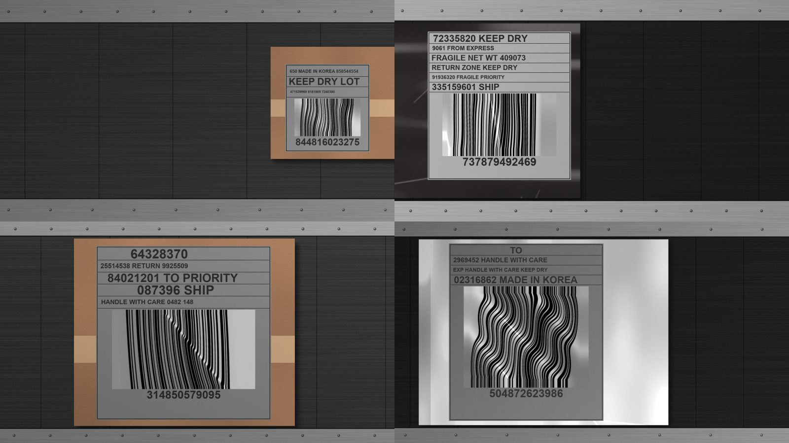

# E2E 벤치마크 v1 — 고정 100장과 기준선 · 2026-09-29

**결론: 같은 100장에서 디코딩만 하면 15장, 우리 서비스(`run()` 전체)는 57장을 읽는다.**
늘어난 42장 중 **32장은 1단계 검출 크롭**이, 8장은 2·3단계 기하 보정이, 2장은 배율
재시도가 만들었다. 가장 큰 손실은 **검출(66/100)**이고, 저해상도에서 특히 크다(low 14/34).

사용법과 기록 규칙은 [`docs/benchmark/README.md`](../../benchmark/README.md)에 있다.
여기는 **세트를 왜 이렇게 만들었나**와 **기준선에서 무엇이 보였나**를 남긴다.

> 전부 합성 데이터 기준이다. 실촬영 검증이 아니다.

## 왜 만들었나

최종 결과보고서에 두 가지를 보이려고 한다.

1. **단계를 붙일수록 얼마나 좋아지나**
2. **우리 서비스 없이 디코딩만 할 때 vs 우리 서비스를 쓸 때**

그러려면 코드가 바뀌어도 **같은 사진으로** 계속 재야 한다. 세트는 한 번 만들고
HF `123metro/barcode-datasets` 의 `benchmark/v1/` 에 고정했다. 돌릴 때마다
[`runs.jsonl`](../../benchmark/runs.jsonl) 에 한 줄씩 쌓고, 보고서는 이 기록으로 만든다.

## 네 조건

같은 사진 한 장을 네 조건으로 매긴다. 판독 성공 = 정답 번호와 **완전 일치**다.

| 조건 | 무엇 |
|---|---|
| A | 원본 사진 전체를 그대로 `decode()` — **우리 서비스 없이** |
| B | + 1단계 검출 크롭 (1차 디코딩) |
| C | + 2·3단계 기하 보정 1회 (배율 1.0) |
| D | + 배율 재시도 = `run()` 전체 — **우리 서비스** |

B·C·D 는 `run()` 을 한 번만 돌려서 결과를 나눈다. `run()` 은 1차 디코딩에서 무엇이든
읽히면 거기서 끝나고, 재시도도 무엇이든 읽히면 멈춘다. 그래서 각 조건의 판독 결과가
`run()` 의 중간 결과와 같다 (`scripts/run_benchmark.py` 의 `ladder()`, 테스트 5건).

## 세트



| 구간 | 뜻 | 장수 |
|---|---|---|
| `first_ok` | 사진 전체를 그대로 디코딩하면 읽힘 | 15 |
| `target` | 사진으로는 안 읽히고, 크롭을 정답 제어점으로 펴면 읽힘 | 80 |
| `hard` | 둘 다 안 됨 | 5 |

- 해상도 low / mid / high 에 34 / 34 / 32장씩 나눴다. 구간 비율은 버킷마다 같다
- seed 2026. 학습(42)·평가(7)와 다른 시드이고, 번호 100개도 모두 다르다
- 장면은 **컨베이어 벨트 위 택배 상자(골판지 + 테이프) 또는 비닐 봉투의 송장 라벨**이다
  (상자 40 · 비닐 60, `scripts/benchmark_scene.py`)
- 바코드 크롭은 v1 합성기(`wemeet.data.synthesis`)가 만든 것을 **원본 픽셀 그대로** 붙였다

**15/80/5 는 현장 비율이 아니라 팀이 정한 구성이다.** 보고서의 수치는 "이 100장에서"의
수치다. 목표 구간이 80%라서 A 가 낮은 것은 구성 탓이 크다 (`0005` 문제 2).

### 구간을 크롭이 아니라 장면에서 판정한 이유

처음에는 v1 평가 세트와 같은 방식, 즉 **크롭을 기준으로** 구간을 판정했다. 그렇게 만든
목표 구간 80장을 배경 위에 붙이자 **28장이 보정 없이 그냥 읽혔다.** 조건 A 가 목표
구간을 읽어 버리면 15/80/5 구성이 성립하지 않는다.

원인은 바코드 주변이다. 목표 구간 80장을 주변을 얼마나 남기고 잘랐느냐에 따라 zxing 이
읽은 수가 달라졌다.

| 입력 | 읽힌 수 / 80 |
|---|---|
| 크롭만 | 0 |
| 흰 여백 10 / 40 / 120 px 덧댐 | 2 / 4 / 5 |
| 장면에서 주변 10 / 40 / 120 px 포함 | 12 / 26 / 36 |

흰 여백으로는 거의 안 바뀌고, 실제 주변 배경이 보일수록 읽힌다. zxing 의 이진화가 주변
밝기에 따라 달라지기 때문으로 본다 (추정 — 원인을 코드 수준에서 확인하지는 않았다).
**크롭 기준 구간 라벨은 E2E 조건으로 옮길 수 없다.** 그래서 구간을 장면 기준으로 다시 판정했다.

### 판정 디코더를 SW `decode()` 와 맞춘 이유

장면 기준으로 바꾼 뒤에도 조건 A 가 목표 구간을 13장 읽었다. 판정에 쓴
`label_recipes.decode` 는 zxing-cpp 의 `read_barcode`(한 개)를 부르고, SW `decode()` 는
`read_barcodes`(여러 개)를 부른다. **같은 사진에서 두 함수의 결과가 달랐다.**

- 13장은 `read_barcodes` 만 읽었다
- 1장(006)은 `read_barcode` 가 **틀린 번호**(`WEMEET0408`)를 냈고, `read_barcodes` 는
  정답(`WEMEET0048`)을 읽었다

판정을 SW `decode()` 의 zxing 경로(`_decode_with_zxingcpp`) 그대로 바꾸자, 조건 A 는 정확히
`first_ok` 15장만 읽었다. pyzbar 는 판정에 쓰지 않는다 (PC 마다 깔렸는지가 달라서).

> **AI 파트 확인 필요**: v1 학습·평가 세트의 구간 라벨도 `read_barcode` 로 만들어졌다.
> SW 디코더와 결과가 다를 수 있다.

### 장면에서 크롭을 건드리지 않은 이유

회전·광택·조명을 크롭 위에 얹으면 크롭 픽셀이 바뀐다. 그러면 정답 제어점(NPZ)이 가리키는
위치와, 「정답 제어점으로 펴면 읽힘」이라는 판정이 둘 다 어긋난다. 그래서 포장도 회전하지
않았다. 조명 기울기·센서 노이즈는 크롭 바깥에만 들어간다.

## 기준선 결과

main `4c8bbaf` 파이프라인 그대로다 (YOLO11n-OBB v2 + CLAHE → ResNet18-C3 → TPS 배율 재시도).
디코더는 zxing-cpp 만 (이 PC 에 pyzbar 가 없다). 같은 세트로 두 번 돌려 수치가 같았다.

| 조건 | 정답 | 오독 | 실패 | first_ok | target | hard |
|---|---|---|---|---|---|---|
| A 디코딩만 | 15 | 1 | 84 | 15/15 | 0/80 | 0/5 |
| B + 검출 크롭 | 47 | 1 | 52 | 9/15 | 38/80 | 0/5 |
| C + 보정 1회 | 55 | 1 | 44 | 9/15 | 46/80 | 0/5 |
| D 서비스 전체 | **57** | 1 | 42 | 10/15 | 47/80 | 0/5 |

### 어디서 늘었나 — A → D 의 +42장

| 단계 | 늘어난 장수 |
|---|---|
| 검출 크롭 (A → B) | +32 |
| 기하 보정 1회 (B → C) | +8 |
| 배율 재시도 (C → D) | +2 |

**검출 크롭만으로 목표 구간 38장이 읽혔다.** 사진 전체로는 안 읽히던 것이 크롭하면
읽힌다. 원인은 확인하지 않았다 — 라벨의 글자·칸 선이 사진 전체 디코딩을 방해하고, 크롭이
그것을 걷어낸다는 것이 가설이다. 위 「주변이 보일수록 읽힌다」와 방향이 반대라서,
**주변의 무엇이 도움이 되고 무엇이 방해되는지**는 따로 재야 한다.

따라서 **이 세트에서 2·3단계(AI 기하 보정)의 기여는 +10장**(보정 8 + 재시도 2)이다.
검출된 것 중에서 보면 1차 디코딩이 실패해 2단계까지 간 것이 18장이고, 그중 10장을 살렸다.

### 어디서 잃나 — D 실패 42장

| 원인 | 장수 |
|---|---|
| `not_detected` (검출 실패) | **34** |
| `decode_failed` (검출은 됐는데 못 읽음) | 8 |

**검출이 가장 큰 손실이다.** 검출된 66장만 보면 D 는 57/66 (86%), 목표 구간은 47/54 (87%) 다.

검출 실패는 저해상도에 몰려 있다. 상자·비닐의 차이는 작다.

| 해상도 | 검출 | D 정답 |
|---|---|---|
| low (모듈 1.6~2.2 px) | **14/34** | 11/34 |
| mid (2.5~3.5 px) | 23/34 | 21/34 |
| high (4.0~6.0 px) | 29/32 | 25/32 |

| 포장 | 검출 | D 정답 |
|---|---|---|
| 상자 | 26/40 | 19/40 |
| 비닐 | 40/60 | 38/60 |

`first_ok` 도 B 에서 6장을 잃는다 (15 → 9). 사진 전체로는 읽히는데, 검출이 못 찾았거나
검출 크롭에서는 안 읽히는 경우다.

### 오독 — 목표 0% 인데 1장씩 나온다

| 샘플 | 구간 | A | B·C·D |
|---|---|---|---|
| 065 | target | **오독** | 정답 |
| 097 | target | 실패 | **오독** |

**097 은 우리 서비스가 틀린 번호를 내보낸 경우다.** 1차 디코딩(B)에서 틀린 번호가 나왔고,
`run()` 은 무엇이든 읽히면 멈추므로 보정 단계로 가지 않았다. 물류에서는 못 읽는 것보다
나쁘다 (`docs/parts/sw.md` 「오독은 실패보다 나쁩니다」).

### 시간 (로컬 PC, 참고용)

D 전체 p50 102 ms · p95 484 ms. 단계별 (해당 단계를 거친 샘플만):

| 단계 | 거친 수 | p50 | p95 | 예산 |
|---|---|---|---|---|
| `detect` | 100 | 92 | 111 | 110 |
| `decode_first` | 66 | 9 | 21 | 40 |
| `estimate` | 18 | **230** | 268 | 150 |
| `warp` (누적) | 18 | 60 | **256** | 24 × 3 |
| `retry` | 10 | 48 | 85 | 150 (decode 포함) |

`estimate` 가 예산을 넘는다. 이 PC 가 GPU 로 돌렸는지는 확인하지 않았다. **다른 PC 의
시간과 비교하지 않는다.**

## 한계

- **실제 현장보다 쉽다.** 기울기가 없고, 바코드 위에 광택·그림자·흐림이 없다. 1단계의
  기울기 보정은 이 세트로 평가되지 않는다
- 장면은 절차적으로 그린 것이다. 실사 배경·실제 송장 양식이 아니다
- 100장이라 한 장이 1%p 다. 조건끼리 몇 장 차이는 우연일 수 있다
- 디코더는 zxing-cpp 만 썼다. pyzbar 가 있는 PC 에서는 A 를 포함해 수치가 달라질 수 있다
- 구간 판정은 zxing-cpp 한 가지로 했다. 디코더를 바꾸면 구간 구성이 달라진다

## 다음에 볼 것

| 무엇 | 왜 |
|---|---|
| 저해상도 검출 (low 14/34) | 가장 큰 손실. 검출 모델·입력 크기·CLAHE 설정 |
| 1차 디코딩 오독 (097) | 1차에서 읽힌 번호를 믿을지 — 서비스가 틀린 번호를 내보냄 |
| 검출 크롭이 목표 구간을 읽게 만드는 이유 | 2·3단계 기여를 해석하는 데 필요 |
| `read_barcode` vs `read_barcodes` | v1 라벨 전체에 영향이 있는지 |
| `estimate` 230 ms | 예산 150 ms 초과. GPU 사용 여부부터 |

## 재현

```bash
# 세트 (HF 에 고정본이 있으니 보통은 받기만 한다)
hf download 123metro/barcode-datasets --repo-type dataset --include "benchmark/v1/*" --local-dir downloads/hf
# 다시 만들면 같은 세트가 나온다 (코드 fe4ddb0, seed 2026)
uv run python -m scripts.make_benchmark --out downloads/benchmark-v1

# 실행 — docs/benchmark/runs.jsonl 에 한 줄 추가
uv run python -m scripts.run_benchmark --data-root downloads/hf/benchmark/v1 --note "무엇을 바꿨나"
```
