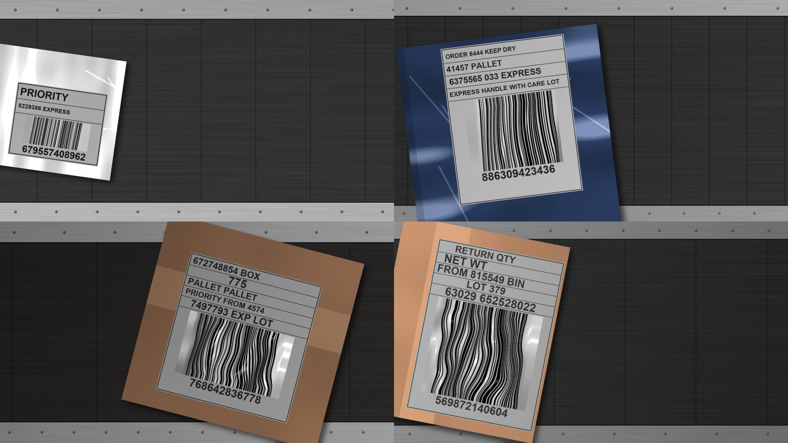

# E2E 벤치마크 v2 — 검출 실패·오독 원인 측정과 단계별 수정사항 · 2026-09-30

**결론: 검출 실패의 원인은 입력 축소다.** 검출기가 1920 px 사진을 960 으로 줄여 보면서 얇은
막대가 뭉개진다. 같은 가중치에 입력만 1920 으로 주면 v2 에서 검출 69 → 99, 서비스 전체(D)
56 → 85 다. 막대 비율(5:3 vs 2.0~2.3)·흰 라벨·CLAHE·기울기는 원인이 아니었다.
**오독은 전부 Code128 이고 1차 디코딩에서 나온다.** 심볼로지 제한으로는 막을 수 없다.
「후보끼리 다르면 받지 않기」와 형식 검사로 관측된 7건 중 6건을 막을 수 있고, **1건은 둘 다로
못 막는다** (형식이 맞는 틀린 번호가 단독으로 나옴).

v1 기록은 [2026-09-29-e2e-benchmark-v1](../2026-09-29-e2e-benchmark-v1/README.md), 사용법은
[`docs/benchmark/README.md`](../../benchmark/README.md)에 있다.

> 전부 합성 데이터이고, **GPU 없는 PC(CPU)** 에서 쟀다. 시간은 예산과 비교하지 않는다.
> 입력 크기 변경은 `--no-log` 시험 실행이다 — 코드는 바꾸지 않았다.

## 왜 v2 를 만들었나

v1 기준선에서 팀원이 검출 실패 원인으로 세 가지를 짚었다 — ① 막대 비율이 1단계 학습과 다르다
(5:3·6:4 vs 2.0~2.3), ② 흰 송장 라벨을 학습에서 본 적이 없다, ③ CLAHE 가 학습 때 없었다.
먼저 v1 에서 하나씩 바꿔 쟀고(아래), 그 결과로 v2 를 **어느 가정이 맞든 채점할 수 있게** 만들었다.



| v1 대비 추가 | 왜 |
|---|---|
| 막대 비율 반반 — `2.0-2.3` 50장 / `5:3\|6:4` 50장 | 두 파트가 같은 50×30 mm 라벨에서 다른 가정을 했고 **어느 쪽도 실물로 확인되지 않았다.** 실물이 확정되면 맞는 절반을 본다 |
| 포장 ±15° 기울기 | v1 은 기울기가 없어 1단계의 기울기 보정이 평가되지 않았다 |
| 크롭 네 꼭짓점 기록 | 검출을 정답 위치로 채점할 수 있게 |

구간 규칙·구성(15/80/5, 해상도 고르게)은 v1 과 같다. seed 2027. 버킷 × 비율 × 구간까지
계획한 개수 그대로 나왔다. HF `benchmark/v2/` (301 파일, manifest sha256 = 로컬).

## 검출 실패 — 무엇이 원인인가 (v1 에서 측정)

같은 100장에서 조건 하나씩만 바꿔 검출했다. 적중 = 박스 중심이 정답 크롭 안.

| 바꾼 조건 | 검출 / 100 | low |
|---|---|---|
| 기준 (CLAHE on, 입력 960) | 66 | 14/34 |
| ③ CLAHE off | 67 | 15/34 |
| ② 라벨·포장 없이 벨트 위에 직접 | 10 | 0/34 |
| ① ② + 막대 비율 5:3 으로 늘림 | 6 | 1/34 |
| **입력 1920 (축소 없음)** | **97** | **32/34** |

- **③ CLAHE**: 차이 없음. `wemeet/ai/detection/__init__.py` 의 "재측정 전 참고치" 가 이제 측정됐다
- **② 흰 라벨**: 없애면 오히려 크게 나빠진다. 어두운 벨트 위에 바로 붙인 조건이라 깔끔한 비교는
  아니지만, "라벨이 방해해서 못 찾는다" 는 아니다
- **① 비율**: 5:3 으로 맞춰도 좋아지지 않는다. v2 에서도 비율별 검출이 34/50 vs 35/50 로 같다
- **입력 축소가 원인이다.** 960 으로 줄이면 low 바코드의 가장 얇은 막대(1.6~2.2 px)가 1 px
  아래가 된다

입력 크기별 (같은 가중치, v1, CPU):

| 입력 | 검출 / 100 | low | 검출 시간 p50 (CPU) |
|---|---|---|---|
| 960 (현재) | 66 | 14/34 | 54 ms |
| 1280 | 86 | 21/34 | 90 ms |
| 1600 | 93 | 28/34 | 125 ms |
| 1920 | 97 | 32/34 | 149 ms |

## v2 결과

| 조건 | 입력 960 (기준선, 기록됨) | 입력 1920 (시험) |
|---|---|---|
| A 디코딩만 | 15 | 15 |
| B + 검출 크롭 | 48 | 69 |
| C + 보정 1회 | 54 | 81 |
| D 서비스 전체 | **56** | **85** |
| 오독 (D) | 2 | 1 |
| 검출 | 69 | 99 |

| D 정답 | 입력 960 | 입력 1920 |
|---|---|---|
| low | 13/34 | 29/34 |
| mid | 23/34 | 31/34 |
| high | 20/32 | 25/32 |
| 막대 비율 `2.0-2.3` | 26/50 | 40/50 |
| 막대 비율 `5:3\|6:4` | 30/50 | 45/50 |
| 기울기 0~5° | 18/35 | 28/35 |
| 기울기 5~10° | 15/31 | 30/31 |
| 기울기 10~15° | 23/34 | 27/34 |

- 기울기가 클수록 나빠지는 경향은 보이지 않는다. 입력 1920 에서는 검출이 각도와 무관하게
  99/100 이다 (0~5° 34/35, 5~10° 31/31, 10~15° 34/34)
- 두 비율의 차이(26 vs 30, 40 vs 45)는 50장씩이라 우연 범위 안이다
- 입력 1920 에서 D 가 29장 늘었다. 2·3단계(B → D)의 몫은 960 에서 +8, 1920 에서 +16 이다 —
  검출된 것이 늘어 2단계까지 가는 샘플이 늘었다

## 오독 — 원인과 막는 법

지금까지 관측한 오독 7건(샘플 × 입력 크기, v1·v2)을 직접 재현했다. **전부 Code128 이고 전부
1차 디코딩(보정 전, 재시도 0)** 에서 나왔다. 같은 샘플도 입력 크기가 바뀌면 검출 크롭이 달라져
후보가 달라진다 (v1 097).

| 샘플 (입력) | 정답 | zxing 이 낸 후보 | 막는 법 |
|---|---|---|---|
| v1 065 (1920) | `WEMEET0760` | `WnMEET0760` · `WEMEET0760` | 후보 불일치 |
| v1 097 (1920) | `WEMEET0290` | `WEMEET5379` · `WEMEET0290` | 후보 불일치 |
| v2 084 (960) | `WEMEET0116` | `WE0EET0545` · `WEMEET0116` | 후보 불일치 |
| v2 056 (1920) | `WEMEET0409` | `WEMEET1423` · `WEMEET0409` | 후보 불일치 |
| v1 002 (1920) | `WEMEET0006` | `2869377152990006` | 형식 검사 |
| v2 029 (960) | `WEMEET0468` | `WEMEET,$c` | 형식 검사 |
| **v1 097 (960)** | `WEMEET0290` | `WEMEET5379` (단독) | **둘 다로 못 막음** |

v1 097 (960) 은 형식이 맞는 틀린 번호가 혼자 나온다. 막으려면 **다른 이미지에서 한 번 더 읽어
같은 번호가 나올 때만 받는** 합의 방식(다른 배율·다른 디코더)이 필요한데, 이 방식은 정답도
놓칠 수 있어 성공률 손실을 재 봐야 한다 (아직 안 쟀다).

- **zxing 하나가 한 이미지에서 서로 다른 Code128 후보를 여럿 낸다.** 둘 다 체크섬을 통과한다.
  `decode()` 는 첫 번째 유효 후보를 고르므로 4건이 틀렸다
- 팀원이 짚은 원인과 대조하면:
  - ① 체크섬이 약하다 — **맞다.** `docs/pipeline-overview.md:162` 의 "체크섬을 통과하면 그 번호를
    믿을 수 있습니다" 는 틀린 문장이다
  - ② 심볼로지 제한이 없다 — 코드는 맞게 짚었다. 하지만 **7건 모두 Code128** 이라 제한으로는
    한 건도 막지 못한다. 문서(「지원 심볼로지: Code128, EAN-13」)와 맞추는 위생 조치다
  - ③ 두 디코더를 대조하지 않는다 — 코드는 맞게 짚었다. 이 PC 에 pyzbar 가 없어 이번 오독의
    원인은 아니다. 대신 **zxing 자기 후보끼리의 불일치**가 실제 원인이었다
  - ④ 재시도가 오독을 늘린다 — 논리는 맞지만, 관측된 7건은 전부 재시도 전(1차)에서 나왔다

## 단계별 수정사항

| 단계 | 파트 | 수정 | 근거 | 우선 |
|---|---|---|---|---|
| 1 검출 | AI | **`DEFAULT_IMGSZ` 960 → 1280~1600** (`wemeet/ai/detection/yolo_obb.py`). 재학습 없음 | 검출 66 → 86~93 (v1), D 56 → 85 (v2, 1920) | **높음** |
| 1 검출 | AI | 학습 때 입력 크기 확인 — 학습 스크립트 기본값은 1280, 추론은 960 | 학습·추론 조건 불일치 가능성 | 높음 |
| 1 검출 | AI | 입력 크기별 시간을 **GPU 에서** 재고 예산(110 ms) 안의 최대값을 고른다 | 위 시간은 CPU | 높음 |
| 1 검출 | AI | CLAHE 주석 갱신 (효과 없음 66 vs 67). 끌지는 GPU 시간과 같이 판단 | 측정 완료 | 낮음 |
| 1·2 공통 | AI | **실제 송장의 막대 영역 가로·세로를 재서** 비율 가정(5:3 vs 2.0~2.3)을 확정 | 검출에는 영향 없음, 2단계 학습 데이터에는 영향 | 중간 |
| 2 기하 추정 | AI | v1 학습·평가 라벨의 `read_barcode` vs SW `read_barcodes` 불일치 확인 (재라벨 필요 여부) | v1 기록: 13/80 차이 | 중간 |
| 3 기하 보정 | SW | 보정 시간(누적 p50 60 / p95 256 ms, CPU)을 현장 PC 에서 재기. CPU 코드라 GPU 와 무관 | 예산 24 ms × 3 | 중간 |
| 4 디코딩 | SW | **유효 후보가 서로 다르면 받지 않는다** (`decode_failed` 로) | 오독 4/7 | **높음** |
| 4 디코딩 | SW | **번호 형식 검사** (자릿수·문자) — 실제 송장번호 규칙 필요 | 오독 2/7 | **높음** |
| 4 디코딩 | SW | 남는 1건: 다른 배율로 한 번 더 읽어 합의할 때만 받기 — 성공률 손실을 먼저 잰다 | 오독 1/7 | 중간 |
| 4 디코딩 | SW | Code128·EAN-13 으로 `formats=` / `symbols=` 제한 | 문서와 일치 (오독 0/7 에 해당) | 낮음 |
| 4 디코딩 | SW | pyzbar 가 있는 환경에서 pyzbar·zxing 결과 대조 | 팀원 분석 ③ | 중간 |
| 파이프라인 | SW | 1차 디코딩 결과에도 위 검사를 적용 — 지금은 1차에서 읽히면 확인 없이 종료 | 오독 7/7 이 1차 | **높음** |
| 문서 | 전원 | `docs/pipeline-overview.md:162` 체크섬 문장 정정 | 1/103 은 믿을 수준이 아니다 | 중간 |
| 벤치마크 | 평가 | 수정이 들어갈 때마다 v2 로 `run_benchmark` 한 줄씩. **GPU PC 한 대로 고정** | 보고서 근거 | — |

> 입력 크기 변경은 D 를 크게 올리지만 오독도 1차 디코딩으로 더 많이 흘려보낼 수 있다
> (v1: 1 → 3건). **디코딩 검사(4단계)와 같이 넣는 것을 권한다.**

## 한계

- 합성 데이터다. 실사 배경·실제 송장 양식이 아니다
- 크롭 위에는 조명·광택·그림자가 없다. 기울기로 인한 보간 한 번이 유일한 추가 열화다
- 100장, 비율별 50장이다. 몇 장 차이는 우연일 수 있다
- 디코더는 zxing-cpp 만 (pyzbar 없음), 시간은 CPU
- 검출 원인 측정(②·①)은 어두운 벨트 위에 바로 붙인 조건이라 학습 배경과도 다르다

## 재현

```bash
uv run python -m scripts.make_benchmark --version v2 --out downloads/benchmark-v2   # 코드 cc9e87a
uv run python -m scripts.run_benchmark --data-root downloads/benchmark-v2 --note "..."
# 입력 1920 시험 (기록 없음)
uv run python -c "import sys, wemeet.ai.detection as d; d.DEFAULT_IMGSZ = 1920; \
sys.argv = ['x', '--data-root', 'downloads/benchmark-v2', '--no-log', '--note', 'imgsz1920']; \
from scripts.run_benchmark import main; main()"
```
